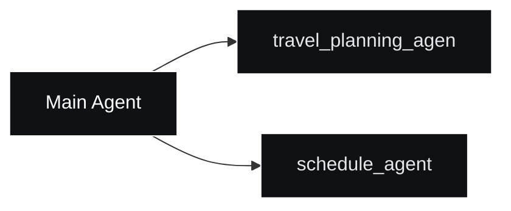

# 🚀 Multi-Agent gRPC Framework for LLM Applications

This project is a **multiple-agent framework** for building LLM applications with **gRPC microservices**.
Its goal is to let one **Main Agent** orchestrate focused **Sub Agents** (such as travel planning and scheduling),
so each agent handles a single domain while reducing context-window usage and unnecessary conversation turns.

## 🧩 Project Positioning
This repository is a **multiple-agent skeleton** for gRPC microservices.

It provides reusable building blocks for:
- gRPC API layer
- dependency injection (Wire)
- tool-calling agent flow
- short-term memory (Redis)
- long-term memory and preference storage (MySQL)
- pluggable LLM providers (Ollama / OpenAI-compatible endpoints)

You can use this project as a starter template, then plug in domain-specific agents (travel planning, support, operations, etc.).

## 📌 Features
- **gRPC Communication**: Efficient inter-service communication using **Protocol Buffers (protobuf)**.
- **LLM Integration**: Uses **Ollama** or other models to generate responses.
- **Dependency Injection**: Managed with **Google Wire**.
- **Database Support**: Uses **Redis** and **MySQL**.

## 🔹 Installation
Before running the service, install the following dependencies:
### **1️⃣ Download Docker Images**
- [Docker](https://www.docker.com/)
    ```shell
    docker pull redis:latest
    docker pull mysql:latest
    docker pull ollama/ollama:latest
    ```
### **2️⃣ Start Redis (Docker)**
- [Redis](https://formulae.brew.sh/formula/redis)
    ```shell
    docker run -d --name redis-server -p 6379:6379 redis:latest
    ```
### **3️⃣ Start MySQL (Docker)**
- [MySQL](https://formulae.brew.sh/formula/mysql)
    ```shell
    docker run -d --name mysql-server -p 3306:3306 -e MYSQL_ROOT_PASSWORD=password -e MYSQL_DATABASE=mydb mysql:latest
    ```
### **4️⃣ Start Ollama (Docker)**
- [Ollama](https://ollama.com/)
    ```shell
    docker run -d --name ollama-server -p 11434:11434 ollama/ollama:latest
    ```
### **5️⃣ Install buf (for gRPC Protobuf management)**
- [buf](https://formulae.brew.sh/formula/buf)
  ```shell
  $ brew install buf
  $ go install google.golang.org/protobuf/cmd/protoc-gen-go@latest
  $ go install google.golang.org/grpc/cmd/protoc-gen-go-grpc@latest
  ```
### **6️⃣ Install wire (for Dependency Injection)**
- [wire](https://github.com/google/wire)
    ```shell
    $ go install github.com/google/wire/cmd/wire@latest
    ```
  
## 🚀 Running the Service
You can use the Makefile to build and run the service efficiently.
### **1️⃣ Tidy up Go modules**
```shell
  make tidy
```
### **2️⃣ Generate Dependency Injection Code**
```shell
  make inject
```
### **3️⃣ Deploy the service using Docker Compose**
```shell
  make deploy
```

## 🛠️ How to Use
### **1️⃣ Configure services**
Edit `config/config.yaml`:
- Set `mysql`/`redis` host and database settings.
- Set `llm.provider` and model config.
- If running inside docker-compose with Ollama service, set:
  - `llm.baseurl: "http://llm:11434"`

### **2️⃣ Start the stack**
```shell
make deploy
```

### **3️⃣ Call gRPC API**
Use Postman gRPC or `grpcurl` to call:
- `chat.v1.ChatService/GenerateMessage`
- `chat.v1.ChatService/StreamMessage`

Recommended request fields:
- `session_id` for multi-turn context
- `user_id` for long-term memory
- `return_tool_results: true` for tool execution traces

## 🌿 Example Branches
A complete example implementation is available in branches:

- `travel_planning_agen`
- `schedule_agent`

Switch to one of them with:
```shell
git checkout travel_planning_agen
# or
git checkout schedule_agent
```

After switching, run:
```shell
make deploy
```
Then the selected branch setup is ready to use.

## 🧠 Multi-Agent Branch Strategy
If you want to build multiple agents, keep domain agents in separate branches.

Before running a branch, check `config/config.yaml` and `depoly/compose.yaml` to avoid host/port conflicts across services.

Recommended architecture:
- One strong `Main Agent` acts as the orchestrator.
- Each `Sub Agent` focuses on one domain task only.
- `Main Agent` routes requests to the right `Sub Agent`.

Why this pattern:
- Reduce context window pressure.
- Reduce unnecessary conversation turns.
- Keep each agent simpler and easier to maintain.

### Architecture Diagram
```text
+------------+        +----------------------+
| Main Agent |------->| travel_planning_agen |
+------------+------->| schedule_agent       |
                      +----------------------+
```

If your Markdown preview supports Mermaid, you can also use:

